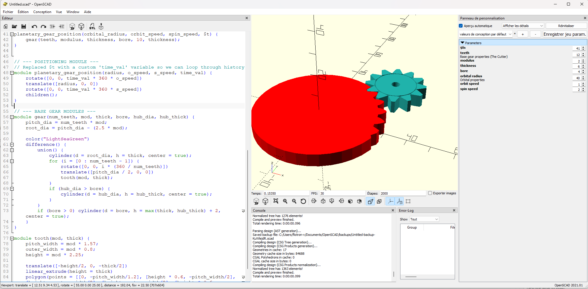

Readme
------


## Requirments
- pip install solidpython2


## A test with animation on OpenSCAD

### 1. Open the file
OpenSCAD and open file `test_openscad\gen_gear_shaper_sim.scad`

### 2. Activate animation
Activate animation on menu **Vue** -> **Animation**

### 3. Settings on the Animation vue
```txt
FPS:    30
Étapes: 2000
```

### 4. Result in image


### 5. Known issues
- The more the time is passing, the more the animation becomes slower
- Parameters orbital_radius, orbit_speed and spin_speed are set by hand instead of beeing parametrized depending on the "sun" cylinder radius, module, etc ...

### 6. Prompts
- [prompt with Gemini](https://gemini.google.com/share/b15bc4d94af1)

1. prompt 1:
```scad
give me openscad code to make a gear
```

2. prompt 2:
```scad
Make me a module to make this gear rotate around an excentered center and rotate around itself. Like the earth planet around the sun
```

3. prompt 3
```scad
Ok, now, I would like to still be able to animate but I would like to be able to move a bit, do a boolean substraction operation, move a bit, do a boolean sub op again and again in order to sculpt the "sun" cylinder to make it becomes a sculpted gear. Could you help?

Actual code
\`\`\`
// --- ANIMATION PARAMETERS ---
// To see the animation, go to: View -> Animate
// Set "FPS" to 30 and "Steps" to 100 in the bottom right panel.

$fn = 40; 

// Base gear properties
teeth = 12;
modulus = 2;
thickness = 6;
bore = 4;

// Orbital properties
orbital_radius = 50; // Distance from the "Sun" (center) to the gear
orbit_speed = 1;     // How many orbits per cycle
spin_speed = 4;      // How many self-rotations per cycle

// --- MAIN EXECUTION ---

// 1. Draw a marker at the center (The "Sun")
color("red") cylinder(d=50, h=thickness+2, center=true);

// 2. Call the planetary module using OpenSCAD's internal time variable ($t)
planetary_gear(orbital_radius, orbit_speed, spin_speed) {
    // Pass the original gear into the module
    gear(teeth, modulus, thickness, bore, 10, thickness);
}

// --- PLANETARY MODULE ---
module planetary_gear(radius, o_speed, s_speed) {
    // 3. Orbit around the central origin
    rotate([0, 0, $t * 360 * o_speed]) 
    
    // 2. Push the gear out to its orbital path
    translate([radius, 0, 0]) 
    
    // 1. Spin the gear on its own axis
    rotate([0, 0, $t * 360 * s_speed]) 
    
    // Children references whatever 3D object you put inside this module bracket
    children(); 
}

// --- BASE GEAR MODULES (From previous step) ---
module gear(num_teeth, mod, thick, bore, hub_dia, hub_thick) {
    pitch_dia = num_teeth * mod;
    outer_dia = pitch_dia + (2 * mod);
    root_dia = pitch_dia - (2.5 * mod);
    
    color("LightSeaGreen")
    difference() {
        union() {
            cylinder(d = root_dia, h = thick, center = true);
            for (i = [0 : num_teeth - 1]) {
                rotate([0, 0, i * (360 / num_teeth)])
                translate([pitch_dia / 2, 0, 0])
                tooth(mod, thick);
            }
            if (hub_dia > bore) {
                cylinder(d = hub_dia, h = hub_thick, center = true);
            }
        }
        cylinder(d = bore, h = max(thick, hub_thick) + 2, center = true);
    }
}

module tooth(mod, thick) {
    pitch_width = mod * 1.57; 
    outer_width = mod * 0.8;
    height = mod * 2.25;
    
    translate([-height/2, 0, -thick/2])
    linear_extrude(height = thick)
    polygon(points = [[0, -pitch_width/1.2], [height * 0.6, -pitch_width/2], [height, -outer_width/2], [height, outer_width/2], [height * 0.6, pitch_width/2], [0, pitch_width/1.2]]);
}
\`\`\`
```